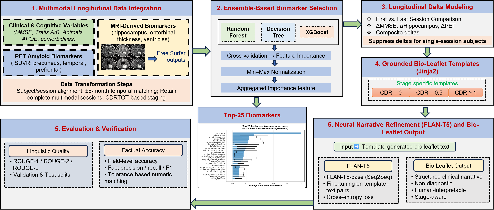

# Grounded Patient-Level Narrative Generation for Alzheimer's Disease

> A controlled natural language generation (NLG) framework that converts structured multimodal Alzheimer's biomarkers into explainable, patient-level clinical summaries ("bio-leaflets"). Published at **IEEE SysCon 2026**.

> 📄 **Published:** IEEE International Systems Conference (SysCon) 2026 · DOI: [10.1109/SysCon66367.2026.11503483](https://doi.org/10.1109/SysCon66367.2026.11503483)

## Overview

Machine learning systems for Alzheimer's disease increasingly rely on multimodal biomarkers, but their outputs are often opaque and poorly suited to transparent clinical communication. This work presents a system-level, controlled NLG framework that turns structured clinical, neuroimaging, genetic, and longitudinal data into grounded, patient-level narrative summaries. Supervised models are used **only** to identify salient biomarkers; narrative generation is governed by deterministic templates and a constrained Transformer refinement step, ensuring factual grounding and clinical safety.

## Key Results

Evaluated on the OASIS-3 longitudinal cohort (862 subjects, 1,340 sessions).

| Metric | Result |
|---|---|
| Field-level factual accuracy | **96.93%** (1,954 fields) |
| Micro-averaged F1 (information extraction) | **90.82%** |
| Precision | 97.20% |
| ROUGE-1 (content fidelity) | 97.72% (test) |
| Clinically significant ("major") errors | **0.0%** |

The system maintained >93% field accuracy and >85% F1 across all disease-severity (CDR) levels, with zero clinically dangerous errors.

## Method

- **Multimodal data:** clinical/cognitive variables, MRI- and PET-derived biomarkers, genetic risk, and longitudinal change, harmonized from OASIS-3 (subject-level splits to prevent leakage)
- **Biomarker salience:** ensemble feature importance (Random Forest + Decision Tree + XGBoost), aggregated and normalized — used for explanation selection, not prediction
- **Longitudinal delta modeling:** first-vs-last-session change features, suppressed for single-session subjects to avoid unsupported temporal claims
- **Grounded templates:** CDR-stage-specific Jinja2 templates with conditional slot logic for factual, hallucination-resistant narratives
- **Neural refinement:** FLAN-T5-base fine-tuned to improve fluency while preserving content, followed by rule-based factual verification

## Design Decisions

- **ML for salience only, not diagnosis.** Predictive models surface which biomarkers matter; they never generate clinical claims — keeping the system non-diagnostic and auditable.
- **Deterministic facts, constrained generation.** Templates own the factual content; FLAN-T5 only refines fluency, which is why zero errors reached the "major" clinical-impact category.
- **Honest metric framing.** High ROUGE (~97%) reflects faithful content reproduction in a constrained, template-anchored task, not superiority over free-form generation. The paper states this explicitly rather than overclaiming.

## Citation

    S. Hossain, B. Tokoli, T. Mondalto, P. Hajibabaee and B. Karaman,
    "Grounded Patient-Level Narrative Generation for Alzheimer's Disease
    Using Multimodal Biomarkers," 2026 IEEE International Systems Conference
    (SysCon), Halifax, NS, Canada, 2026, pp. 1-8,
    doi: 10.1109/SysCon66367.2026.11503483.

> © 2026 IEEE. Personal use of this material is permitted. The accepted manuscript is shared here in accordance with IEEE author posting policy; the definitive version is available via the DOI above.

